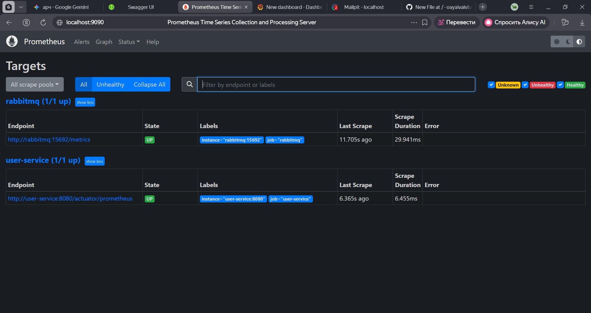
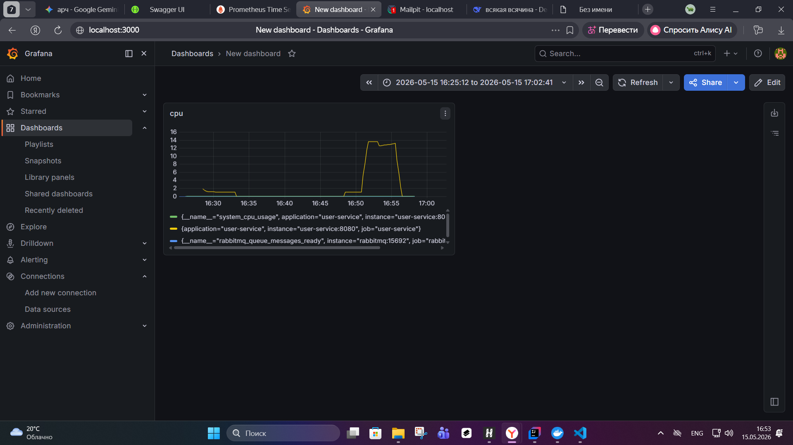
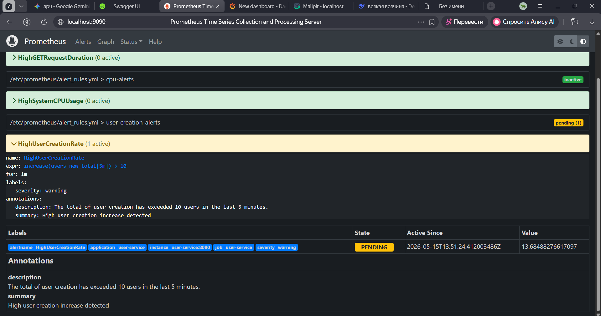
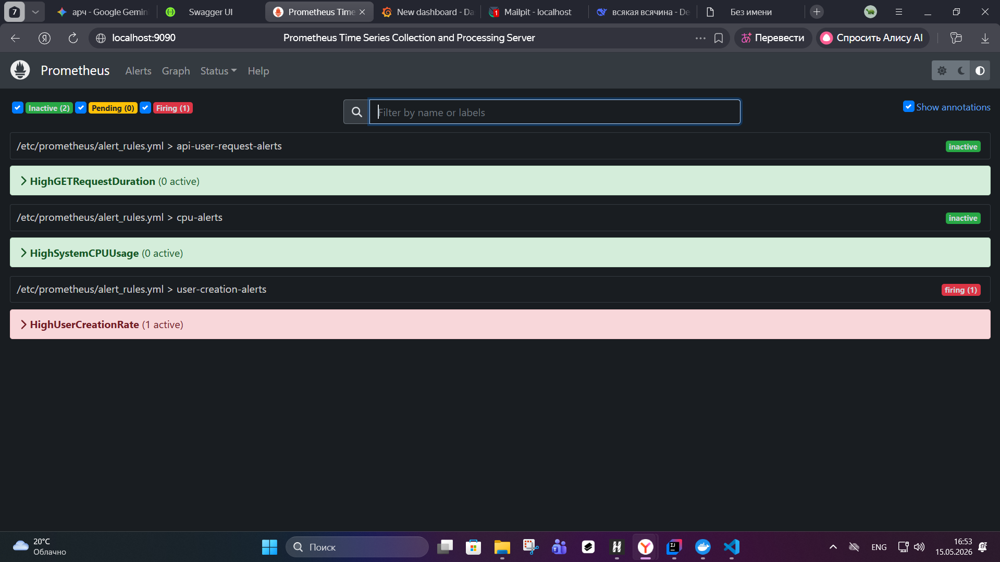
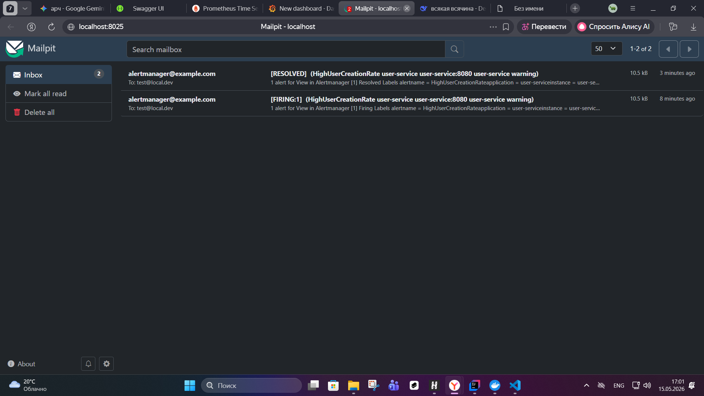

# Отчет по лабораторной работе №4: Observability

**Цель работы:** Настройка системы мониторинга, визуализации метрик и оповещения (Prometheus + Grafana + Alertmanager) для микросервисного приложения.

## 1. Настройка приложения (Instrumentation)

* **Зависимости:** В проект добавлены `spring-boot-starter-actuator` для управления метриками и `micrometer-registry-prometheus` для экспорта данных в формате Prometheus.
* **Конфигурация:** В `application.properties` включен эндпоинт `/actuator/prometheus` для сбора данных.
* **Кастомные метрики:**
* **Counter:** Реализован счетчик созданных пользователей `users.new` (в Prometheus отображается как `users_new_total`). Метрика увеличивается в `UserService` при успешной регистрации.
* **Timer:** Реализован замер длительности выполнения API-запросов (GET и POST) с использованием `Timer` и меток (labels) `method="get"` и `method="post"`.

## 2. Инфраструктура и сбор данных

* **Docker Compose:** Все сервисы мониторинга (Prometheus, Grafana, Alertmanager) и инфраструктура (Postgres, RabbitMQ, Mailpit) развернуты в контейнерах.
* **Сбор с внешних систем:** Настроен сбор метрик с **RabbitMQ** (порт 15692) с использованием встроенного плагина Prometheus.
* **Targets:** В Prometheus подтверждено успешное подключение (статус UP) для `user-service` и `rabbitmq`.

> **Скриншот подключенных сервисов:**

## 3. Визуализация в Grafana

В Grafana подключен источник данных Prometheus (`http://prometheus:9090`) и настроено 3 информационных панели (дашборда):

1. **Загрузка CPU:** системное использование ресурсов.
2. **Регистрации пользователей:** динамика создания новых записей за последние 5 минут.
3. **Очереди RabbitMQ:** количество сообщений, ожидающих обработки.

> **Скриншот дашборда Grafana:**

## 4. Система алертинга (Alertmanager)

Настроено 3 правила оповещения в `alert_rules.yml`:

1. **HighSystemCPUUsage:** критический уровень нагрузки на процессор (>90%).
2. **HighUserCreationRate:** предупреждение при создании более 10 пользователей за 5 минут.
3. **HighGETRequestDuration:** критическая задержка ответа GET-запросов (>2 сек).

**Проверка работы:**
При создании 10+ пользователей через Swagger алерт перешел в статус **Pending**, затем **Firing**. Сообщение было успешно доставлено на тестовый SMTP-сервер **Mailpit**.

> **Скриншоты алертов:**
> * **Статус Pending в Prometheus:**
> 
> 
> * **Письмо в Mailpit (Mailpit):**
> 

## Итог

В ходе работы была реализована полная цепочка Observability: от генерации кастомных метрик в коде до их визуализации и автоматического оповещения о нештатных ситуациях. Системы успешно взаимодействуют внутри Docker-сети.
